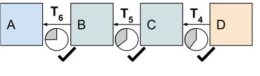

# 2. Overview

### 2.1 Goals

We propose a new payment channel communication protocol designed to be suitable for even low bandwidth MANETs. We accomplish this by reducing the transmission overhead needed to make payments between nodes. Our protocol also minimizes the trust required between mesh nodes when not connected to the internet.

### 2.2 Approach

To reduce payment overhead that must be relayed to the internet via gateways, we use an _aggregate signature_ scheme that maintains cryptographic security but only requires half the signature data. Signature data is the largest part of a transaction that can not be inferred or compressed. Signature data is reduced by signers locally negotiating one aggregated signature instead of sending two signatures, one per signer to confirm a transaction. This also reduces on-chain transaction fees.

After a payment channel has been established between nodes they only need to locally communicate with each other to update the state of their channel. We use an efficient commitment scheme to commit the payer to a new channel state without requiring the payment receiver to respond until they have proof that a message is delivered. This reduces total transmission overhead substantially.

We transmit to the internet only the minimum information necessary to reconstruct each _implied transaction_ signed with a single aggregate signature. A small set of predefined transaction types also reduces the information that must be transmitted to reconstruct each implied transaction.

Payments to mesh relays and internet gateways are prepaid by the data sender and are only valid if the destination node returns a secret value created by the sender. This ensures that relay nodes are only paid for successfully delivered data. Destination nodes also earn value when they confirm they received data to ensure they cooperate in settling transactions.

Our system proposes the use of internet connected _witness nodes_ to efficiently verify payment channel setup and settlement transactions for mesh nodes that are not directly connected to the internet. Nodes without internet connections communicate via gateway nodes that are both connected to the mesh and to the internet. All other transactions are negotiated locally between mesh nodes within direct communication range as payment channel updates. The latest channel update is cached for later online settlement if the channel is not cooperatively closed.

### 2.3 Protocol

In any mesh network, nodes transmit messages to nearby nodes that includes both a header and data payload. Payload data could be anything from an SMS message to arbitrary internet protocol packets. The header contains information on how to route the data payload to a destination node. Nearby relay nodes read and modify header information as they route the message to its destination.

Our incentive protocol builds on this existing behavior and adds additional header information to create and update payment channels between nodes. If a node has set up a payment channel with another node, they can authorize a payment to that node in exchange for it relaying some data to a destination node. Each relay node commits to pay the next node along the route and uses the same delivery condition. Each node proposes to pay the next node less than they received to transmit the data; the difference represents the value they earn for relaying the data. Each payment update must satisfy certain conditions to be valid. The primary payment condition is that the final destination node confirms receipt of the data.

Once the data has been received, the destination node transmits back a secret value to the data sender that satisfies the primary payment condition. This payment receipt is used by the nodes that relayed the data to update the state of their payment channels with each other.

Once the destination node confirms receipt of the data by revealing a secret, any node that receives the secret can settle their update transaction on the distributed ledger even if their channel partner disappears or becomes uncooperative. Nodes can observed transactions settled by other relay nodes involved with the same message delivery to learn the secret they need to settle their own channel updates.

When a payment channel does not already exist between two nodes it must be set up and funded. A transaction that funds a new channel can not be confirmed locally between mesh nodes because it involves a payment that could have been committed to fund a different channel. These transactions must be confirmed directly by the Bitcoin network before they are relied on.

A mesh connected node must use an internet gateway to access the Bitcoin network, but staying in sync with the state of the blockchain is impractical over a low bandwidth network. Instead, mesh nodes query a witness node they trust. Witness nodes are persistently connected to the internet so they can monitor and report in a low bandwidth way the current state of transactions of interest. Witness nodes will earn payments if they report truthfully about the state of the blockchain. They can be held accountable by checking the underlying blockchain data when a node has online access or by using multiple independent Witness nodes.

