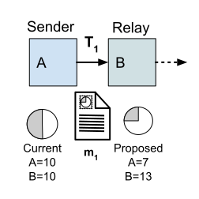
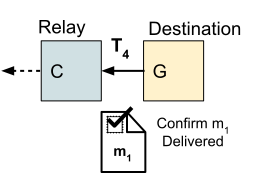
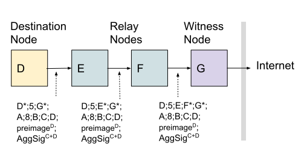
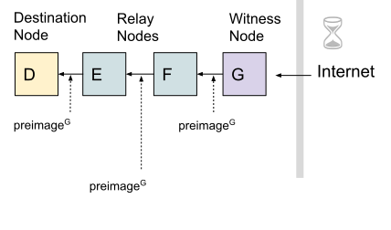

# 4. Protocol Details

### 4.1 Nodes

Mesh nodes generally use the same hardware and software, but serve different roles in the process of transferring data through the mesh network. Depending on the situation, they can be the sender, relayer or destination for data. Relay nodes can also act as gateways for sending data from a local mesh network to a regional or global network like the internet.

Nodes connected to the internet may also act as a provider of blockchain transaction services. For bandwidth constrained networks we expect blockchain access will involve private interactions with an online trusted witness node.

#### Sender Node

A node that wishes to send data commits to spend a specific number of incentive tokens conditioned on confirmation the data is delivered. A sender commits to spend more tokens to improve the likelihood of a successful delivery, increase the distance data will be relayed and/or incentivize a gateway to relay the data. The mesh routing protocol will generate an estimated delivery cost as part of its routing metrics and can update its estimates based on the delivery success of prior messages.

#### Relay / Gateway Nodes

A node that receives a message from a sender or other relay node will cache and potentially retransmit the message. A relay may use heuristics based on both topological and incentive costs to determine the likelihood a message will ultimately be delivered and use this information to decide whether or not to relay it. A node’s current battery charge and its other cached messages are also considered. A relay may also prioritize messages from senders with a confirmed commitment of value to the payment channel or if it helps to rebalance a channel. A relay node that also has internet access can earn value as a gateway by advertising this via the routing protocol. Nodes either charge a standard price to relay, or advertise their fee in advance as part of their routing metrics.

#### Destination Node

A node that receives a message for which it is the destination acts much like a relay node, but they can immediately confirm the payment channel update that increases their channel balance. When they reveal the encrypted secret that came with the message they received, any node involved in the delivery of the message can also update or settle their associated transaction.

**Figure 13**: Node G produces the secret that proves delivery of payload data m1. Once their delivery receipt is received their last corresponding update and settle transactions becomes valid and can be recorded on the Bitcoin blockchain.

All relay nodes involved with delivering the message can use the final revealed secret to confirm their own payment channel updates. Once a node has a delivery receipt, they can perform a unilateral close of the channel if a node they relayed for becomes unresponsive. After a node receives proof that a message they relayed is received, they can negotiate with their upstream relay node to update or cooperatively close their respective payment channel balances instead of immediately committing the confirmed update to the blockchain.

Nodes that re-transmit message delivery receipts do not need to wait for an on-chain confirmation of an incentive payment. Also, as they re-transmit the payment receipt back to the message sender, they encourage more messages to be sent along their route. Proof of delivery implies future transmissions along the same route will also result in payment. Extra incentive payments can also prepay a message receiver to reply. Any reply could also include the previous delivery receipt secret to increase efficiency.

#### Witness Node

Witness nodes are expected to be persistently connected to the internet and operated by mesh network users to facilitate more efficient confirmation of settled transactions. A witness node receives transactions as a data payload from mesh nodes that wish to have payment channel set up and settlement transactions confirmed by the Bitcoin blockchain. If a transaction is valid, but not yet confirmed on the ledger, the witness node will submit the transaction to the blockchain and wait for it to be confirmed. They then send the secret included with the transaction payload back to the original node that requested it be validated.

Instead of running their own online witness node, off-grid mesh nodes can also use nodes run by others they trust and can incentivize their function validating transactions by including payments that the witness node can only collect if the transaction is confirmed on the blockchain. It also may be possible to redeem prepaid Lightning invoices with online nodes to trustlessly fund new channels. [\[44\]]()

### 4.2 Data Relay

Here we describe in detail the steps required for nodes to send and receive token payments in exchange for delivering data on the mesh network.

#### Sync

To optimize for low bandwidth communication between mesh nodes, information necessary for incentive payments should be cached and inferred instead of transmitted whenever possible.

We assume a sync phase where nodes periodically connect to the internet directly and cache information useful for recreating implied transactions. Nodes cache this information and can also broadcast it over the mesh network to nodes that do not have synched caches. Nodes can also publish their own public keys and cache metadata useful to optimize message delivery such as their geolocation and the witness node\(s\) they trust to verify transactions. The information for each node is associated with a unique short node ID used to look up each node’s extended public key. The node ID is also used by the routing protocol to identify nodes.

Node information can be published to witness nodes who gossip it to other nodes and archive it for offline nodes. Cached data is signed by the public keys they are associated with and can have an expiration date to protect against syncing wrong or out-of-date data.

After the initial sync phase, offline nodes will have a cached version of the extended public key, incentive balances and other hints of all other nodes. To reduce the size of this information nodes can choose to sync only information from nodes that register as being active in a subset of geographic locations.

#### Delivery

A node normally sends data to another node using the standard MANET routing protocol supported by the device. Our optional incentive protocol appends additional header information to the standard network level headers and uses augmented routing heuristics. Nodes will prioritize the relay of messages that include valid incentive headers in order to earn incentives from successfully delivered data.

Before incentivized message delivery proceeds, mesh nodes must build their routing tables—starting with learning about nearby nodes. Once a node identifies nearby nodes from their broadcasts it can propose to create payment channels with them. A node must have a payment channel with any node identified as the next hop to deliver a message to. A node sending data negotiates channel updates conditioned on their data being received. Each relay node follows the same procedure as the sending node, but negotiates to pay the next node less than they receive.

The sender encrypts a secret with the message they send to the destination node. Any node involved in relaying the message commits to a payment to the next relay hop if the decrypted secret is presented. Transactions that create or settled a payment channel are sent to an internet connected witness node. When nodes renegotiate a local payment channel update they invalidate the previous channel update. A new channel update must be published within a typically long time window \(eg. one week\) after the last update to prevent an outdated update from becoming final.

Six message delivery protocol steps are described below:

**Step 1: Discover Topology**

Our incentive protocol assumes an “on-demand” style routing protocol. Before routing tables have been populated, messages are sent using flooding. Flooded messages do not specify the ID of the node that should be the next hop for delivery. During this phase, the incentive protocol is not active. As messages are successfully delivered, routing information propagates between nodes to populate their routing tables. Nodes also advertise the cost for different routes so this information can be considered when routes are selected.

**Step 2: Propose Channels**

To create a payment channel between nodes A and B requires both nodes sign a series of transactions spending from a 2-of-2 multi-signature address. Suppose Node B will receive payments from Node A first. Then Node B proposes the channel to adjacent Node A who will fund it. Because the transactions are partially signed by Node B before Node A funds the channel, Node A can be confident that a refund transaction from the multi-signature address will be valid if Node B becomes unresponsive.

Node B can propose opening a channel any time after receiving a route discovery flood message that includes Node A’s ID. Node B includes in their transmission an incentive header \([Setup 1]()\) that partially signs a set of transactions necessary to open the payment channel funded by Node A.

**Step 3: Send Message**

![Figure 16: Node A sends a message to Node D. This example shows the additional information \(eg. &#x201C;A\*;8;D\*, SigA&#x201D;\) that must be transmitted between nodes to enable the reconstruction of the implied transactions. The Node IDs with asterisks do not need to be transmitted because the information already exists in the network headers required to deliver the message. The initial amount of tokens spent by Node A to send the message is 8 and SigA is Node A&#x2019;s signature for the first set of implied transactions. The final transaction sent by Node D has a complete set of signatures and the preimage so it can be settled on the blockchain.](.gitbook/assets/fig16.svg)

After receiving a payment channel proposal from Node B, Node A has what they need to send a message to some other node in the network via Node B. For example, when Node A sends a message to Node D along a route that includes Node B as the first hop. Node A includes in their transmission an incentive header \([Setup\_2]()\) with a signature to add value to the payment channel with node B and an incentive header \([Negotiate\_1]()\) or if the channel has already been funded adds header \([Negotiate\_2]()\). These headers update the channel to transfer some amount of incentive value to Node B. Node B will only be able to settle the payment channel update if Node D reveals the preimage secret to confirm they received the message from node A. Each transaction in the chain of relay nodes contains the condition that Node D a preimage included in the message from Node A sent to Node D.

If Node C is the next hop that Node B must use to relay the message to Node D, Node B must follow a similar procedure as Node A to create and/or update a payment channel with node C. Likewise, if node C is adjacent to Node D, then they create and/or update a channel paying any remaining tokens to Node D.

**Step 4: Message Received**

When the message arrives at its destination—for example, Node D has received the message from Node A—then Node D updates the state of their payment channel with Node C by transmitting an incentive header \([Receipt 1]()\) that includes their preimage confirming receipt of the message. Now the transaction is complete and can be presented to a witness node to be published on the global blockchain. After Node C receives the message receipt confirmation they can include an incentive header \([Receipt\_2]()\) to update the state of their payment channel with Node B. Node B follows the same procedure to update the state of their payment channel with Node A.

Once a node has updated the state of their payment channel they can send additional messages that update the channel state or cooperatively close the channel.

Note that a node that receives incentive payments from a newly created channel can use that value in the reverse direction without themselves committing value. In this situation they are refunding credit they received from an upstream node. It is only important to receive confirmation from an online witness node of the on-chain settlement of a channel in situations where a node does not reciprocally relay messages for another node. The reverse acknowledgement shown in Figure 16 is used to updated channel states and so relaying it does not require additional incentive. The data receipt acknowledgement can also be combined with new data flowing in the reverse direction for efficiency.

#### Witness

The message delivery steps described above commit to incentive payment transactions that must be settled on the distributed ledger to be finalized. Until the transaction that funds a payment channel has been settled, any transaction chain that includes a payment from that new channel could become invalid. Likewise, a final channel update transaction must be settled within a specific time after the payment channel is closed.

Nodes can continue to use a channel with an unverified funding transaction, but if the funding transaction ultimately does not verify, then any payments they made to other nodes for delivery can still be collected by those nodes.

When a payment channel between two nodes is closed, either cooperatively or unilaterally, the last update should also be recorded or verified within a standard timeout window to prevent an old update from being settled.

To verify and settle transactions we add steps 5 and 6 to the base message delivery protocol:

**Step 5: Record Transactions**

Any node that has an incentive transaction can settle it on the blockchain if it includes the message receipt preimage from the destination node required to make the transaction valid. To do this, a node can repeat step 3 with a message composed of the “hint” information needed by a witness node to reconstruct the transaction to be verified or recorded. The destination node for this message is a witness node trusted or operated by the sender. The “hint” information and incentive header must pass through an internet gateway if the sending node is not connected to the internet.

The node that sends a message containing a transaction to be verified or recorded must include an incentive token payment that will be collected by the relay nodes and the witness node that verifies or records it. So settling a transaction requires creating a second transaction with relay incentives from the sending node to the witness node. Using an aggregate signature created by both channel parties reduces the amount of data that must be verified to confirm a transaction.

**Step 6: Verify Transactions**

A witness node receives, reconstructs, validates and records incentive transaction chains and receives an incentive payment in the same way as other relays or message receivers. Once the publishing transaction is sufficiently confirmed in the distributed ledger, the witness node can also provide a message that proves the transactions is settled, in addition to providing their preimage. The witness node sends an incentive header \([Witness]()\) back through the mesh network to the node that requested the transactions to be recorded in the same way as step 4 above. Any node that trusts the witness node can now depend on transactions that were included in or depend on the now confirmed transaction chain.

