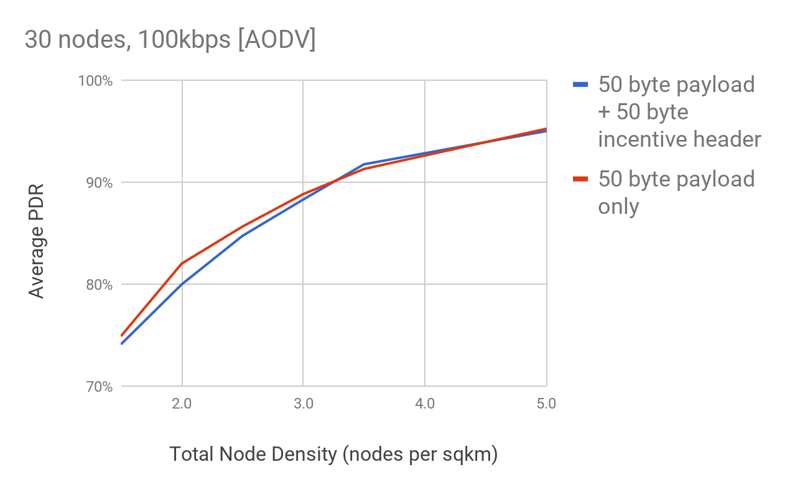
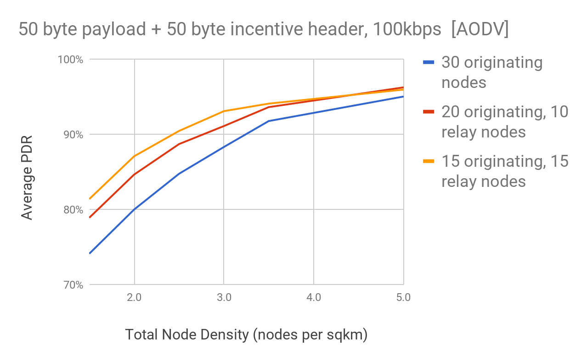

# 7. Analysis

### 7.1 Delivery Ratio

We model the effect of increased packet sizes due to additional incentive protocol overhead. We compare delivery rates with and without the addition of a nominal 50 byte incentive header.

Incentive headers are appended to the standard routing headers that accompany payload data. The largest part of an incentive header is a 64 byte signature. We assume additional hint information of approximately 6 bytes plus 4 bytes per hop with an average of 3 hops for an estimated total of 50 bytes per incentive header.

We use an ns-3 [\[34\]]() simulation of a mesh network composed of 30 nodes running the AODV routing protocol at different node densities. Nodes randomly move and run an application that transmits a 50 byte payload to another random node selected from a fixed subset of originating nodes. Nodes send data every 30 seconds for a total of 20 minutes with some initial random start time and transmit at a data rate of 100 Kbps.

Our simulations focus on packet delivery ratio \(PDR\) which measures the ratio of packets sent versus the number delivered.

We look at different ratios of nodes originating data versus those that only relay data for others. Non-originating nodes are meant to model incentivized nodes that are available to relay data even when they are not sending or expecting to receive data themselves.

Our simulations looked at the following questions:

1. The effect on PDR of adding an additional 50 byte incentive header to each 50 byte payload.
2. The effect of increasing the proportion of non-originating nodes due to incentivization.

Figures 19 shows that adding an additional 50 bytes of incentive header does not significantly reduce the PDR in our simulations except modestly for low network densities.

Figure 20 shows the effect of increasing the proportion of non-originating \(relay only\) nodes in our simulations. Relay only nodes represent the effect of incentives to motivate people to leave their nodes on when not actively using them.

Overall these results show that the decrease in PDR caused by incentive header overhead is modest and only at low node densities. Incentives that increase the proportion of non-originating nodes increase PDR, especially at low densities.

**Figure 19**: This graph shows the average PDR using the AODV protocol on a network with 30 nodes at different densities.

**Figure 20**: This graph shows the average PDR using the AODV protocol across a range of node densities. We compare a network of 30 originating nodes to one with a third and a half non-originating relay only nodes.

